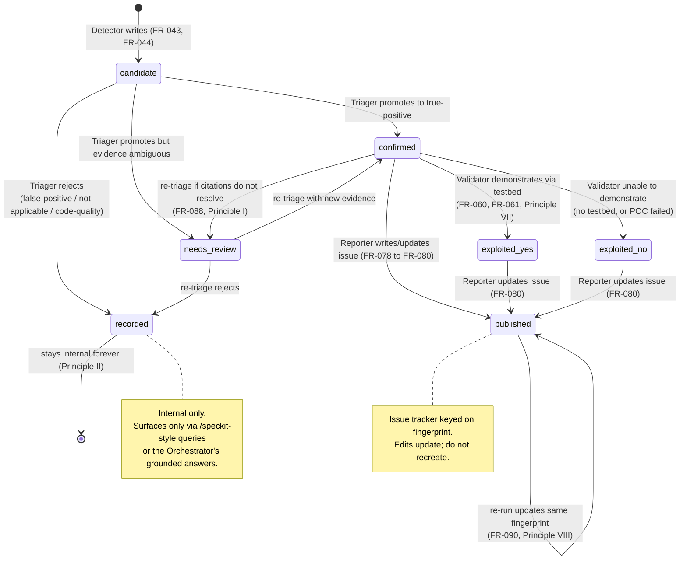
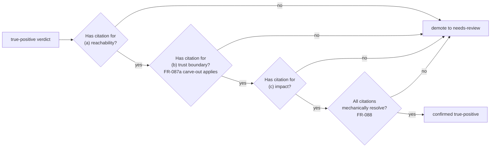
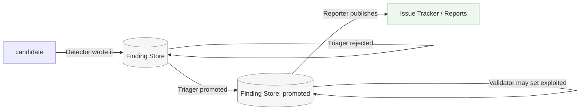

# Finding Lifecycle

**Audience:** anyone reasoning about a finding's state, especially Triager / Validator / Reporter implementers and reviewers checking conformance to Principles I, II, VII.

This page is a **visual companion** to [`spec.md` §7](../../spec.md#7-finding-lifecycle). The spec is normative; this page links its sections, FRs, and the constitution principles that constrain each transition.

## State machine



Where the diagram and the spec disagree, the spec is right (specifically [`spec.md` §7.1](../../spec.md#71-states) is the canonical state diagram).

## Verdict semantics

From [`spec.md` §7.2](../../spec.md#72-verdicts):

| Verdict | Surfaces? | Authority |
|---|---|---|
| `true-positive` | Yes (FR-057) | Triager assigns after evidence gate (FR-052) |
| `false-positive` | No | Triager |
| `needs-review` | Per FR-057 clarification | Triager |
| `not-applicable` | No | Triager |
| `code-quality` | No | Triager |

A finding has **exactly one** verdict at a time (FR-085). Re-triage replaces the verdict; it does not add a new one.

## Evidence gate (Principle I in action)

[`spec.md` §7.3](../../spec.md#73-evidence-gate) is the most important quality control in the system.

Each `true-positive` MUST carry citations for three legs:



**Carve-out (FR-087a):** for "presence-is-the-vulnerability" classes (hard-coded credentials, deprecated cryptographic primitives, sensitive values committed to source), the trust-boundary leg is satisfied by "the source repository itself" and reachability by "the file is in the build". Impact still requires a citation.

**Why mechanical resolution (FR-088) matters:** an LLM cites confidently. The check exists because the LLM's confidence is not evidence; the cited code being real is evidence. A "true-positive" whose lines do not exist in the target is demoted *without exception*.

## Exploited (Principle VII in action)

[`spec.md` §7.4](../../spec.md#74-exploited):

`exploited` is set only by the **Validator**, only after an **independent, clean-room reproduction** of the headline impact on the live testbed (FR-060, FR-061, FR-089).

Specifically forbidden:

- The Triager setting `exploited` because evidence looks compelling.
- The Reporter setting `exploited` because the writeup convinced reviewers.
- The agent that wrote the proof-of-concept also setting `exploited`.
- "Would be exploitable if".
- "Verified the mechanism if not the impact".
- "A similar issue was exploited".
- "Demonstrated under a debugger".

The freshness requirement is structural: the agent that builds a POC has incentive to call it successful. A different agent, given only the artifact and the claim, runs it and observes the impact. If the impact is observed, the flag is set. If not, the flag is not set, and the finding remains a confirmed `true-positive` without `exploited`.

## Surfacing (Principle II in action)



Detection volume is high by design. Triage rejection volume is also high — and that is fine. The reviewer never sees rejected candidates. They see only what survived triage; validation may later add an `exploited` status.

The internal store retains rejected findings (FR-086) so that re-runs can recognize "we already looked at this" and re-runs do not re-surface known-rejected findings.

## Fingerprint (Principle VIII in action)

[`spec.md` §7.5](../../spec.md#75-fingerprint):

```
fingerprint = hash(normalized_path, function_or_symbol_name, vulnerability_class)
```

What is excluded, and why:

- **Line numbers** — change with any nearby edit. A line-number-bearing fingerprint causes every re-run after a code change to re-file the same finding as new.
- **Code snippets** — same problem; whitespace and refactors break the hash.
- **Detection timestamps** — guarantee non-stability. Pointless to include.

What is included, and why:

- **Path** — distinguishes "the same bug class in two files" as two findings.
- **Symbol** — survives reformatting; breaks only when the function is moved or renamed (which *is* the right point to call it new).
- **Class** — distinguishes "this function has SQL injection" from "this function has CSRF".

Deduplication, cross-run inheritance, and "update issue, do not recreate" all key on the fingerprint (FR-091).

## Where each principle applies

| Transition | Principle | FR(s) |
|---|---|---|
| True-positive surfacing gate | II — Surface only what survives | FR-057, FR-079 |
| Verdict assignment | I — Evidence over assertion | FR-052, FR-087, FR-088 |
| `exploited` flag set | VII — Exploited means demonstrated | FR-060, FR-061, FR-089 |
| Issue tracker write | VIII — Fingerprints stable under edit | FR-090, FR-091 |
| Internal retention of rejections | II | FR-086 |

## See also

- [`role-interactions.md`](role-interactions.md) — sequence diagrams that traverse this state machine.
- [`../principles/anti-patterns.md`](../principles/anti-patterns.md) — failure modes for Principles I, II, VII, VIII.
- [`../worked-examples/example-evidence-gate.md`](../worked-examples/example-evidence-gate.md) — three findings walked through the gate.
