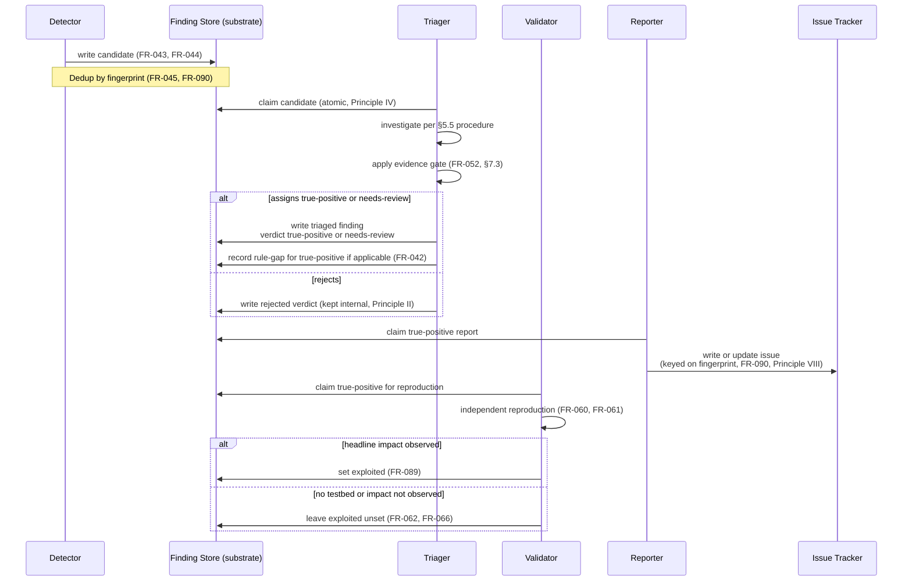
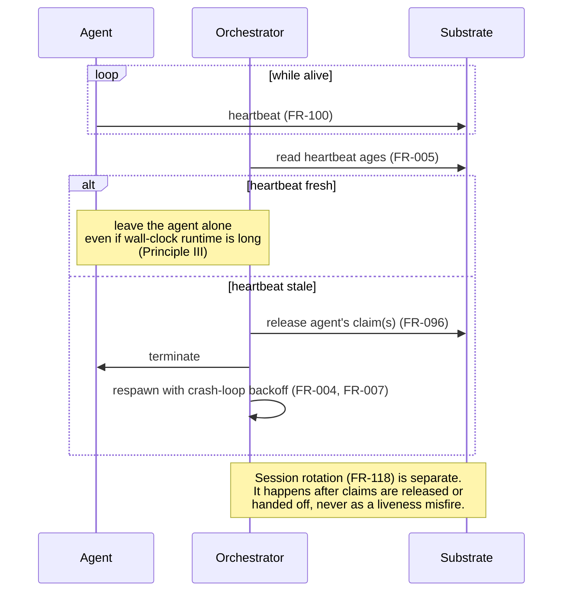
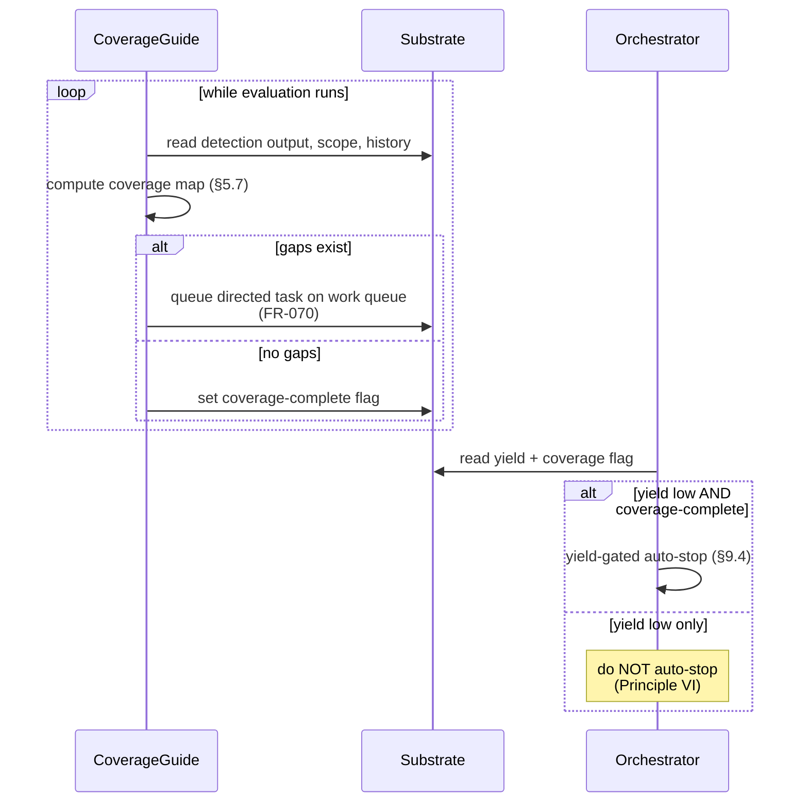
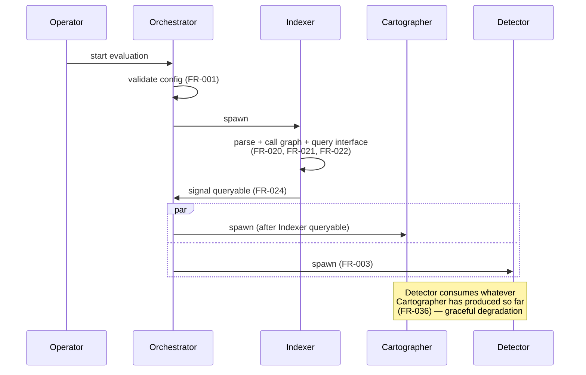
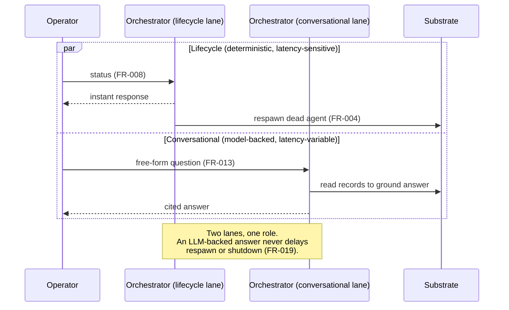

# Role Interactions

**Audience:** a platform engineer or reviewer who wants to see how the eight core roles cooperate across a finding's lifetime, in one diagram per flow.

The spec describes each role section by section ([`spec.md` §5](../../spec.md#5-core-agent-roles)). This page presents the **cross-role views**: the same information, viewed as flows. Every flow cites the FRs it depicts; none invents new requirements.

## 1. Detection → Triage → Validation → Report

The primary finding pipeline.

**Key invariants visible in the flow:**

- The Detector never writes to the issue tracker (FR-044).
- The Triager is the only role that promotes a finding to surfaceable status (FR-052, FR-057).
- The Validator owns independent reproduction and the `exploited` flag, not verdict promotion or demotion (FR-060, FR-061, FR-089).
- The Reporter keys on fingerprint, not line number (FR-090, Principle VIII), so cross-run inheritance and "update, do not recreate" both work.

## 2. Orchestrator heartbeat / reclaim

Liveness, atomic claim, mortal claims (Principles III and IV).

**Why this is structured the way it is:**

- A wall-clock timeout cannot distinguish "hung" from "waiting on rate-limited upstream" (Principle III rationale).
- Reclaim is from the **substrate**, not from the agent process. The agent may already be a corpse; the substrate enforces that its claims do not outlive it (Principle IV).
- Session rotation (FR-118) is a deliberate cost-control rotation of a heartbeating agent's session *after* its current claim is settled. It is not a liveness signal.

## 3. Coverage-Guide feedback loop

Coverage-Before-Yield (Principle VI).

**Why two conditions, not one:**

- Yield alone is noisy. It dips on hard targets early and recovers later. Auto-stopping on yield alone fires on the first dry spell.
- Coverage alone says nothing about progress on each uncovered cell.
- The conjunction "yield low AND coverage complete" is the honest "done" signal: we looked everywhere and the rate of new findings has flatlined.

## 4. Indexer + Cartographer gating

Why detection cannot start before the knowledge layer is ready.

**Visible from the diagram:**

- FR-003 forbids spawning non-Indexer roles before the Indexer is queryable. Skipping this gate produces detection candidates that cannot be triaged ("who calls this" is unanswerable).
- FR-036: roles consume whatever portion of the security map exists at the time they need it. They do not hard-fail when it is partial.

## 5. Operator interaction surface

Why conversational queries do not block lifecycle handling (FR-019).

## See also

- [`finding-lifecycle.md`](finding-lifecycle.md) — the state machine that the diagrams above traverse.
- [`substrate-contracts.md`](substrate-contracts.md) — the substrate interface every flow above depends on.
- [`rule-gap-flywheel.md`](rule-gap-flywheel.md) — how rule-gap recording (FR-042) closes the detection-to-prevention loop.
