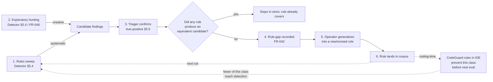

# The Rule-Gap Flywheel

**Audience:** anyone trying to understand the detection-to-prevention loop the seed README highlights as Foundry's central contribution.

The README's [Companion: CodeGuard](../../README.md#companion-codeguard) section describes a six-step loop. This page is a longer narrative companion, with FR citations and pointers into the spec.

> Foundry did not invent CodeGuard; Foundry was designed to *consume* it, and to contribute back the one thing a static rule corpus cannot do for itself: grow from operational experience.

That contribution is the flywheel.

## The loop

## Step by step

### 1. Rules sweep ([§5.4 / FR-037](../../spec.md#54-detector))

For every function in scope, the Detector applies each rule in the corpus as an LLM-evaluated check, with the function body and call-graph context from the Indexer.

- **Granularity matters**: function-level (with caller/callee context) is the unit at which an LLM can reason about data flow without context exhaustion. File-level loses "where does this input come from"; line-level loses "what does this function do with it".
- **Rules vs. brittle pattern matching**: rules are LLM-evaluated, so they accept context-aware variations the model can recognize but a regex cannot.

### 2. Exploratory hunting ([§5.4 / FR-040](../../spec.md#54-detector))

In parallel with rule-based sweeps, exploratory agent instances investigate freely, given:

- The evaluation goals.
- The Cartographer's security map.
- The testbed description (if any).
- Persistent notes from prior runs.
- Read access to source; configured network access to the testbed.

The highest-severity findings in the seed authors' evaluations were consistently from exploratory hunting, not from rules. Rules find what they describe; humans-with-models find what no rule yet describes.

### 3. Triage confirms ([§5.5](../../spec.md#55-triager))

The Triager reviews candidates from both sources, applies the evidence gate ([§7.3](../../spec.md#73-evidence-gate)), and either promotes to `true-positive` (with `needs-review` as an honest fallback when evidence is ambiguous) or rejects with reasoning.

### 4. Rule-gap recorded ([FR-042](../../spec.md#54-detector))

This is the closing of the loop. From the spec:

> When a finding produced by exploratory hunting (FR-040) is confirmed `true-positive` and no rule in the corpus would have produced an equivalent candidate, the Triager MUST record a **rule-gap** entry (finding reference, vulnerability class, the pattern that existing rules failed to match) for operator review.

Without FR-042, exploratory discoveries stay one-offs and the rule corpus does not improve. With FR-042, every exploratory true-positive that "no rule fired on" becomes a candidate rule-gap entry.

### 5. Operator generalizes (manual; supported by Self-Improver §6.5)

A human reviewer (or the optional [Self-Improver extension](../../spec.md#65-self-improver)) reads the rule-gap entry and asks: "what's the *generalization* of this finding that should fire on its class, not just on this instance?"

This is the step the model alone cannot reliably do. Generalizing from one example to "this class of bug" requires judgment about what makes the example representative.

### 6. Rule lands in corpus

The new (or revised) rule is added to the corpus. From this point on:

- Every future evaluation, on every target, runs against this rule on the first pass.
- The class is now caught **systematically** instead of needing exploratory hunting to rediscover.
- Exploration is freed to look further out, where rules still don't yet exist.

## The second-order effect: prevention

The same CodeGuard rule corpus loads into LLM coding assistants as a secure-coding rule set. So:

- The bug class your last evaluation taught the corpus to **detect** is now **prevented** at the keystroke, in every developer's editor, before the next evaluation runs.
- Each turn of the flywheel improves detection here and prevention everywhere the corpus is consumed.

This is the asymmetry the README highlights: a rule, once landed, compounds across every future evaluation **and** every developer's editor session that uses the same corpus.

## Why this requires the rest of the system

The flywheel is only as good as the gates feeding it:

- **If Triage promotes by judgment instead of by evidence (Principle I)**, rule-gap entries are noisy: the corpus grows with rules that fire on non-bugs.
- **If the substrate stranded findings (Principles III/IV)**, exploratory discoveries die before becoming gap entries.
- **If fingerprints are unstable (Principle VIII)**, "did any rule fire on this finding" is unanswerable across re-runs.
- **If detection candidates are surfaced directly to humans (Principle II)**, reviewers stop reading the channel before exploratory discoveries reach Triage.

In other words: the seed's value is not the flywheel diagram. It is that everything else in the spec was designed to keep the flywheel loaded with high-quality fuel.

## What the adopter must author

The flywheel is designed; the *content* is yours:

- The rule corpus itself ([§5.4](../../spec.md#54-detector); [CodeGuard](https://github.com/cosai-oasis/project-codeguard) is one format).
- The "generalization" step from rule-gap entry to rule.
- The Triager's investigation procedure ([§5.5](../../spec.md#55-triager)).
- The review process by which rule-corpus PRs land.

See the README's [What the seed gives you, and what it does not](../../README.md#what-the-seed-gives-you-and-what-it-does-not).

## See also

- [`role-interactions.md`](role-interactions.md) — diagrams of detection → triage → validation.
- [`finding-lifecycle.md`](finding-lifecycle.md) — where rule-gap entries fit in the state machine.
- [`../adoption/extension-roles-when.md`](../adoption/extension-roles-when.md) — Self-Improver enablement criteria.
- [`../worked-examples/example-detection-rule.md`](../worked-examples/example-detection-rule.md) — a worked example of a CodeGuard rule mapped to FR-037.
